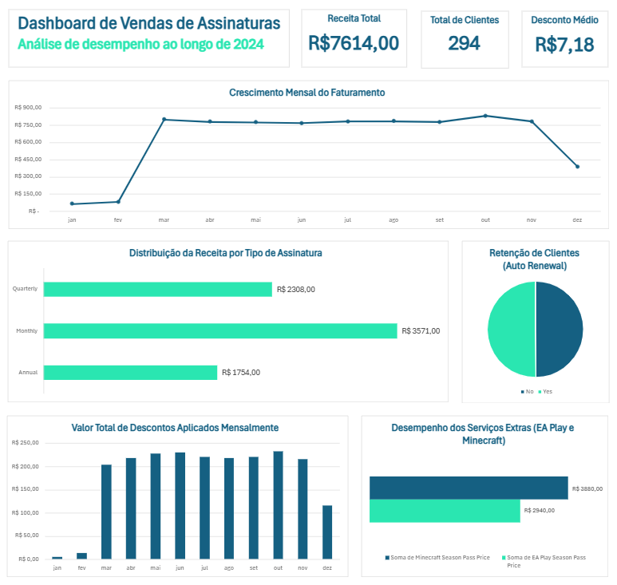

# Dashboard de Vendas de Assinaturas

## Sobre o projeto

Esse projeto foi desenvolvido com o objetivo de praticar análise de dados e construção de dashboards no Excel.

A ideia foi pegar uma base de dados de assinaturas digitais e transformar em um painel visual simples, mas útil, que permita entender o comportamento das vendas ao longo do tempo.

---

## O que foi analisado

No dashboard, foquei em responder algumas perguntas básicas:

* Como a receita evolui ao longo dos meses?
* Qual tipo de assinatura gera mais valor?
* Quantos clientes mantêm a renovação automática?
* Qual o impacto dos cupons de desconto?
* Quanto os serviços adicionais contribuem para a receita?

---

## Sobre os dados

A base contém informações de clientes e assinaturas, incluindo:

* tipo de plano
* data de início
* renovação automática
* tipo de assinatura (mensal, trimestral e anual)
* valores de produtos adicionais
* cupons de desconto
* valor total

A base de dados foi disponibilizada pela plataforma DIO como parte de um desafio prático do curso.

Observação: os serviços adicionais possuem valores fixos, então essa parte da análise não apresenta muita variação.

---

## Como reproduzir o projeto

1. Baixe o arquivo `dashboard.xlsx` disponível no repositório
2. Abra no Microsoft Excel
3. Caso necessário, atualize os dados (Dados → Atualizar Tudo)
4. Utilize os filtros do dashboard para explorar as informações

---

## Autora

Bruna Dionísio, estudante de Ciência de Dados.
